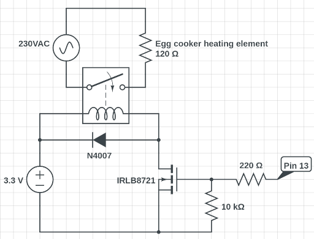

# Smart-Egg-Cooker
Design for a WiFi-enabled egg cooker with touchscreen and Home Assistant integration

Libraries used: GUIslice by ImpulseAdventure, TFT_eSPI by Bodmer, and ThingPulse_XPT2046_Touch by ThingPulse.

GUIslice and TFT_eSPI libraries included because the configuration is a little tricky. All rights to GUIslice reserved by ImpulseAdventure under the MIT licence. All rights to TFT_eSPI reserved by Bodmer under the BSD licence.

## Commands to compile:
```python3 -m venv venv                                                                                             ✔ 
source venv/bin/activate
pip3 install esphome
pip3 install tornado esptool
esphome run eggcooker.yaml```

## Components used:
* ESP32
* ILI9431 touchscreen (SPI variant)
* A random NMOS I had lying around
* 3V-controlled 230VAC relay
* N4007 diode 
* Buzzer
* Hi-Link HLK-PM03
* Off-the-shelf €15 egg cooker
* Some solder and a perfboard

## Connections:
* 3.3V and ground delivered by Hi-Link

Display:
* T_CS   12
* T_IRQ  27
* TFT_DC 2
* TFT_CS 5
* TFT_RST 25
* LED   26
* T_DO/SDO(MISO) 19
* T_DIN/SDI(MOSI) 23
* T_CLK/SCK 18

Other peripherals:
* Buzzer on pins 16 and 17
* 

## Licence
Project released under GPL3

GUIslice released under MIT, all rights reserved for ImpulseAdventure
TFT_eSPI released under BSD, all rights reserved for Bodmer
